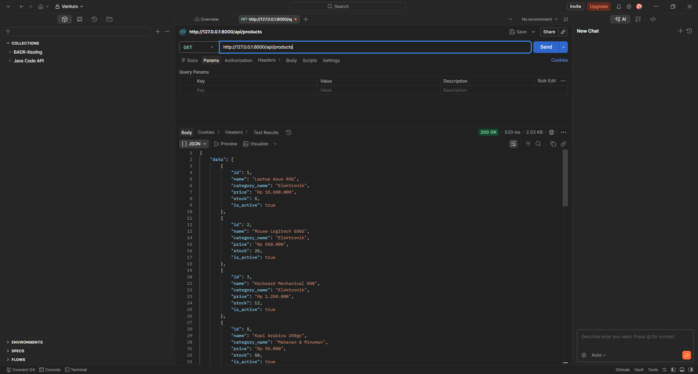
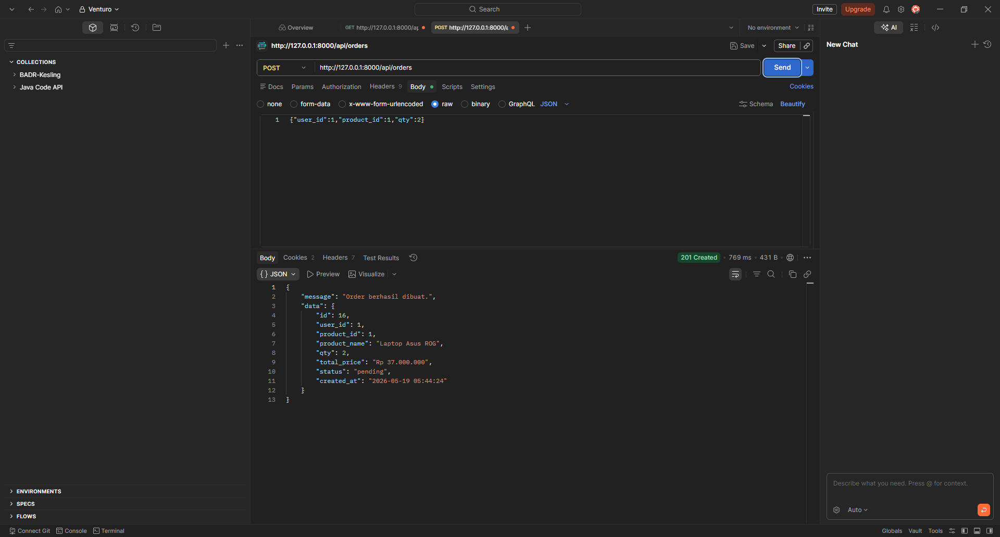
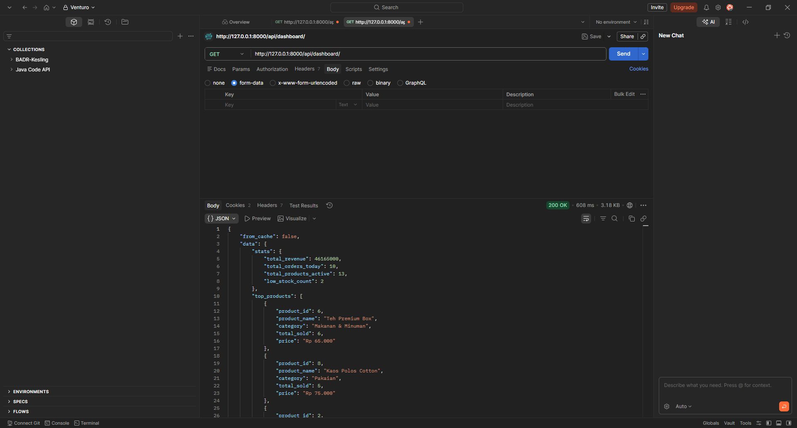
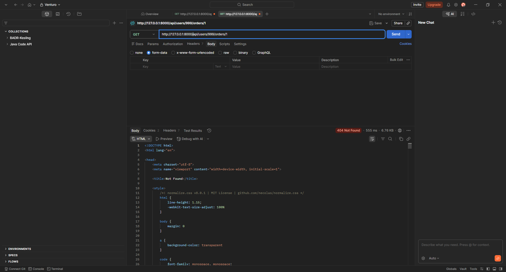

# Praktikum Laravel API — BAB III

## Soal 1 — GET Daftar Produk Aktif

`GET {{base_url}}/api/products`

Endpoint mengembalikan hanya produk dengan `is_active=1`, terpaginasi 10 per halaman, mendukung filter search (LIKE pada name) dan filter kategori.

### Test 1.1 — Daftar default (halaman 1)

| Field | Value |
|---|---|
| Method | `GET` |
| URL | `{{base_url}}/api/products` |
| Body | — |

**Expected:** `200 OK`
- `data` berisi 10 produk (semua `is_active: true`)
- Produk ID 4 (Monitor LG) & ID 10 (Celana Jeans) **tidak** muncul karena inactive
- `meta.total: 13`, `meta.current_page: 1`, `meta.last_page: 2`, `meta.per_page: 10`
- `links.next` menunjuk ke `?page=2`
- Tiap produk punya field: `id`, `name`, `category_name`, `price` (format `"Rp 18.500.000"`), `stock`, `is_active`

### Test 1.2 — Filter search

| Field | Value |
|---|---|
| Method | `GET` |
| URL | `{{base_url}}/api/products?search=logitech` |

**Expected:** `200 OK` — `meta.total: 1`, data berisi `Mouse Logitech G502`.

### Test 1.3 — Filter kategori

| Field | Value |
|---|---|
| Method | `GET` |
| URL | `{{base_url}}/api/products?category_id=2` |

**Expected:** `200 OK` — `meta.total: 3`, hanya produk kategori `Makanan & Minuman` (Kopi Arabica, Teh Premium, Indomie Goreng).

### Test 1.4 — Search + Kategori (kombinasi)

| Field | Value |
|---|---|
| Method | `GET` |
| URL | `{{base_url}}/api/products?search=kopi&category_id=2` |

**Expected:** `200 OK` — `meta.total: 1`, hanya `Kopi Arabica 250gr`.

### Test 1.5 — Pagination halaman 2

| Field | Value |
|---|---|
| Method | `GET` |
| URL | `{{base_url}}/api/products?page=2` |

**Expected:** `200 OK` — `data` berisi 3 produk terakhir, `meta.from: 11`, `meta.to: 13`, `links.next: null`.

### Hasil Postman — Soal 1



---

## Soal 2 — POST Order: Validasi, Kalkulasi & DB Transaction

`POST {{base_url}}/api/orders`

Menerima body JSON, validasi via Form Request (pesan Bahasa Indonesia), cek stok, kalkulasi `total_price = price × qty`, simpan order + decrement stok di dalam `DB::transaction()`.

### Test 2.1 — Validasi error (body kosong)

| Field | Value |
|---|---|
| Method | `POST` |
| URL | `{{base_url}}/api/orders` |
| Headers | `Accept: application/json`, `Content-Type: application/json` |
| Body (raw JSON) | `{}` |

**Expected:** `422 Unprocessable Entity`

```json
{
  "message": "User wajib diisi. (and 2 more errors)",
  "errors": {
    "user_id":    ["User wajib diisi."],
    "product_id": ["Produk wajib diisi."],
    "qty":        ["Jumlah pesanan wajib diisi."]
  }
}
```

### Test 2.2 — Produk tidak ditemukan

| Field | Value |
|---|---|
| Method | `POST` |
| URL | `{{base_url}}/api/orders` |
| Body (raw JSON) | `{"user_id":1,"product_id":99999,"qty":1}` |

**Expected:** `422` — `errors.product_id: ["Produk tidak ditemukan."]`

> Catatan: validasi `exists:products,id` di Form Request dijalankan dulu sebelum `findOrFail()`, jadi response 422 (bukan 404). `findOrFail()` tetap ada di controller sebagai safety net.

### Test 2.3 — Stok tidak mencukupi

| Field | Value |
|---|---|
| Method | `POST` |
| URL | `{{base_url}}/api/orders` |
| Body (raw JSON) | `{"user_id":1,"product_id":1,"qty":10}` |

Laptop Asus ROG (`product_id=1`) stock awal 5, di-request 10.

**Expected:** `422`

```json
{
  "message": "Stok produk tidak mencukupi.",
  "errors": {
    "qty": ["Stok tersedia hanya 5, sedangkan permintaan 10."]
  }
}
```

### Test 2.4 — Order sukses

| Field | Value |
|---|---|
| Method | `POST` |
| URL | `{{base_url}}/api/orders` |
| Body (raw JSON) | `{"user_id":1,"product_id":1,"qty":2}` |

**Expected:** `201 Created`

```json
{
  "message": "Order berhasil dibuat.",
  "data": {
    "id": 1,
    "user_id": 1,
    "product_id": 1,
    "product_name": "Laptop Asus ROG",
    "qty": 2,
    "total_price": "Rp 37.000.000",
    "status": "pending",
    "created_at": "2026-05-19 12:00:00"
  }
}
```
### Hasil Postman — Soal 2



**Verifikasi efek samping** — buka `GET /api/products?search=Laptop`:
- Stok Laptop Asus ROG sekarang `3` (turun dari 5 karena `DB::transaction` menyimpan order + decrement stok secara atomic).

### Test 2.5 — Qty < 1 (validasi min)

| Field | Value |
|---|---|
| Method | `POST` |
| URL | `{{base_url}}/api/orders` |
| Body (raw JSON) | `{"user_id":1,"product_id":1,"qty":0}` |

**Expected:** `422` — `errors.qty: ["Jumlah pesanan minimal 1."]`

---

## Soal 3 — Dashboard Analytics

### Test 3.1 — Dashboard summary (cache MISS pertama)

| Field | Value |
|---|---|
| Method | `GET` |
| URL | `{{base_url}}/api/dashboard` |

**Expected:** `200 OK`, `from_cache: false`

```json
{
  "from_cache": false,
  "data": {
    "stats": {
      "total_revenue": 46165000,
      "total_orders_today": 9,
      "total_products_active": 13,
      "low_stock_count": 1
    },
    "top_products": [
      {"product_id": 6, "product_name": "Teh Premium Box",   "category": "Makanan & Minuman", "total_sold": 6, "price": "Rp 65.000"},
      {"product_id": 8, "product_name": "Kaos Polos Cotton", "category": "Pakaian",           "total_sold": 5, "price": "Rp 75.000"},
      ...
    ],
    "latest_orders": [
      {
        "id": 15,
        "user":    {"id": 1, "name": "Test User", "email": "test@example.com"},
        "product": {"id": 2, "name": "Mouse Logitech G502", "price": "Rp 850.000"},
        "qty": 2,
        "total_price": "Rp 1.700.000",
        "status": "completed"
      }
      // ... 9 order lain
    ]
  }
}
```

Field penting yang harus dicek di Postman:
- `stats.total_revenue` — sum `total_price` dari order `status=completed`
- `stats.total_orders_today` — count order dengan `created_at` hari ini
- `stats.total_products_active` — `13` (15 dikurangi 2 inactive)
- `stats.low_stock_count` — count produk dengan `stock < 5` (`1`: Laptop Asus ROG)
- `top_products` — array 5 item, urut `total_sold` desc, masing-masing punya `category` (artinya Eager Loading `product.category` jalan)
- `latest_orders` — array 10 item, masing-masing punya field `user` & `product` nested (artinya `with('user','product')` jalan)

### Test 3.2 — Dashboard summary (cache HIT)

Ulangi `GET {{base_url}}/api/dashboard` segera setelah test 3.1.

**Expected:** `200 OK`, **`from_cache: true`** dengan payload `data` identik. Kalau di backend ada perubahan order baru, data tetap stale sampai cache expire (300 detik / 5 menit) atau di-flush manual.

### Test 3.3 — Flush cache manual

| Field | Value |
|---|---|
| Method | `DELETE` |
| URL | `{{base_url}}/api/dashboard/cache` |

**Expected:** `200 OK`

```json
{
  "message": "Cache dashboard berhasil dihapus."
}
```

### Test 3.4 — Verifikasi cache benar-benar terhapus

Setelah Test 3.3, ulangi `GET {{base_url}}/api/dashboard`.

**Expected:** `from_cache: false` lagi (cache sudah di-rebuild dari query).

### Hasil Postman — Soal 3



---

## Bonus — Scoped Binding

`GET {{base_url}}/api/users/{user}/orders/{order}`

Route otomatis memastikan `order.user_id` sama dengan `{user}` lewat `->scopeBindings()`. Kalau order yang diminta bukan milik user di path, return 404.

### Test B.1 — Valid (user 1 punya order 1)

| Field | Value |
|---|---|
| Method | `GET` |
| URL | `{{base_url}}/api/users/1/orders/1` |

**Expected:** `200 OK`

```json
{
  "data": {
    "id": 1,
    "user":    {"id": 1, "name": "Test User", ...},
    "product": {"id": 2, "name": "Mouse Logitech G502", ...},
    "qty": 5,
    "total_price": "Rp 4.250.000",
    "status": "completed"
  }
}
```

### Test B.2 — Setup user kedua (sekali saja)

Jalankan via tinker di terminal:

```bash
php artisan tinker --execute="App\Models\User::factory()->create(['name'=>'Other User','email'=>'other@test.com']);"
```

### Test B.3 — Invalid (user 2 coba akses order 1 yang dimiliki user 1)

| Field | Value |
|---|---|
| Method | `GET` |
| URL | `{{base_url}}/api/users/2/orders/1` |
| Headers | `Accept: application/json` |

**Expected:** `404 Not Found`

```json
{
  "message": "No query results for model [App\\Models\\Order] 1"
}
```

Scoped binding berhasil mencegah user lain mengakses order yang bukan miliknya.

### Test B.4 — User tidak ada

| Field | Value |
|---|---|
| Method | `GET` |
| URL | `{{base_url}}/api/users/999/orders/1` |
| Headers | `Accept: application/json` |

**Expected:** `404` dengan message `No query results for model [App\\Models\\User] 999`.

### Hasil Postman — Bonus Scoped Binding



---
